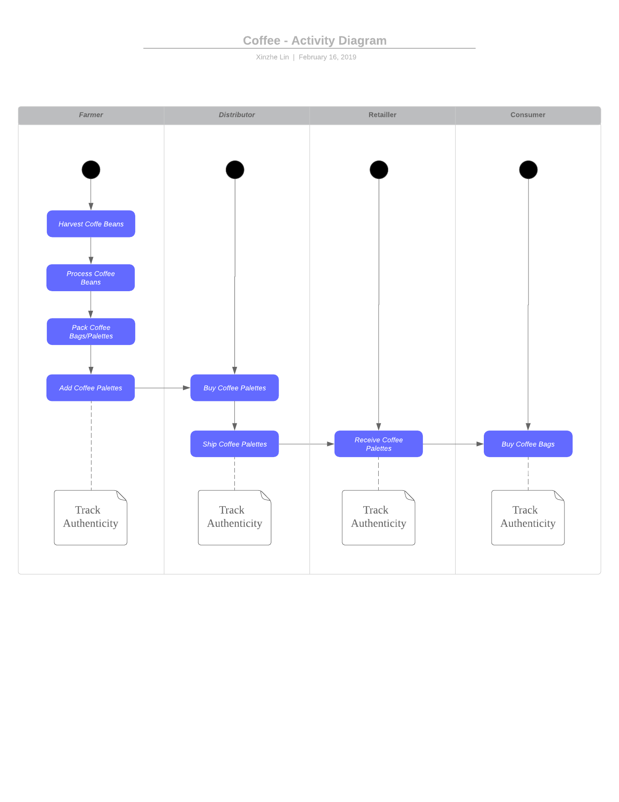
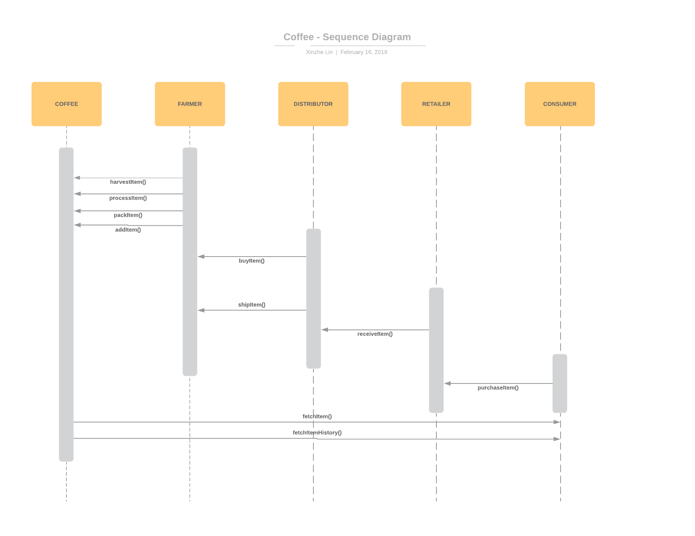
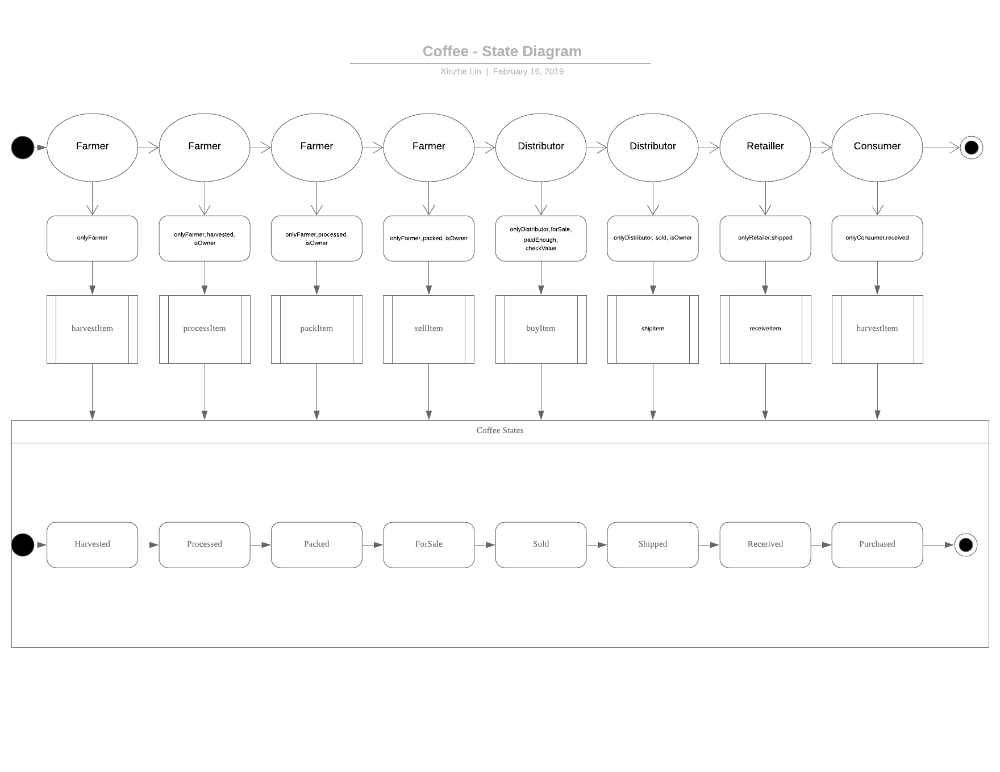
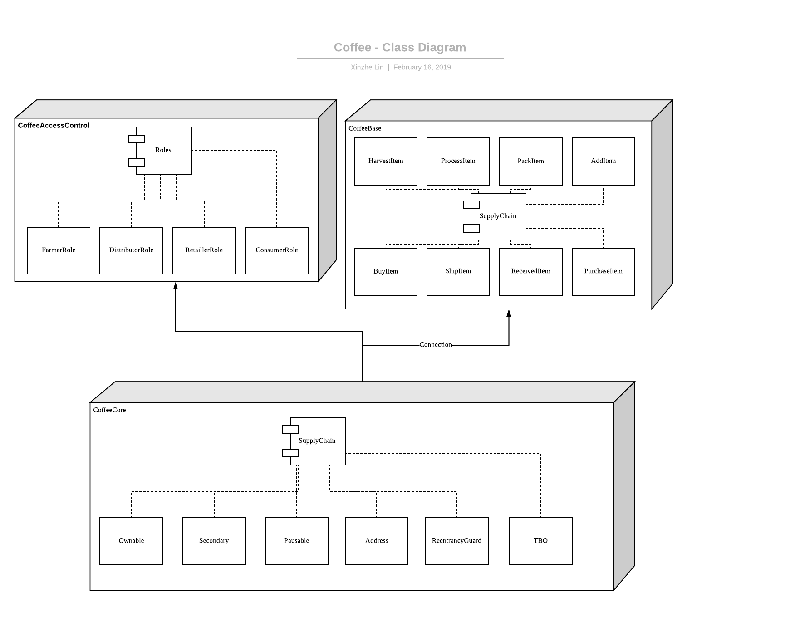

# Coffee Supply chain & data auditing

This repository containts an Ethereum DApp that demonstrates a Coffee Supply Chain flow between a Seller, Distributor, Retailer and Buyer. 

The user story is similar to any commonly used supply chain process. A Seller can add items to the inventory system stored in the blockchain. A Buyer can purchase such items from the inventory system. Additionally a Seller can mark an item as Shipped, and similarly a Buyer can mark an item as Received.

## The DApp UML: 









## Getting Started

These instructions will get you a copy of the project up and running on your local machine for development and testing purposes. See deployment for notes on how to deploy the project on a live system.

### Prerequisites

Please make sure you've already installed ganache-cli, Truffle version 4 and enabled MetaMask extension in your browser.

```
ganache-cli https://www.truffleframework.com/docs/ganache/quickstart
Truffle version 4 https://www.truffleframework.com/docs/truffle/getting-started/installation
MetaMask https://metamask.io/
```

### Installing

A step by step series of examples that tell you have to get a development env running

Clone this repository:

```
git clone https://github.com/linxinzhe/nd1309-Project-6b-Coffee
```

Install all requisite npm packages (as listed in ```package.json```):

```
npm install
```

Launch Ganache:

```
ganache-cli -m "enlist scene predict panda element donkey essay mother original stand oven wheat"
```

In a separate terminal window, Compile smart contracts:

```
truffle compile
```

This will create the smart contract artifacts in folder ```build\contracts```.

Migrate smart contracts to the locally running blockchain, ganache-cli:

```
truffle migrate
```

Test smart contracts:

```
truffle test
```

In a separate terminal window, launch the DApp:

```
npm run dev
```

## Built With

* [Ethereum](https://www.ethereum.org/) - Ethereum is a decentralized platform that runs smart contracts
* [Truffle Framework](http://truffleframework.com/) - Truffle is the most popular development framework for Ethereum with a mission to make your life a whole lot easier.
* [lite-server](https://www.npmjs.com/package/lite-server) - Lightweight development only node server that serves a web app, opens it in the browser, refreshes when html or javascript change, injects CSS changes using sockets, and has a fallback page when a route is not found.

## Acknowledgments

* Solidity
* Ganache-cli
* Truffle
* lite-server
