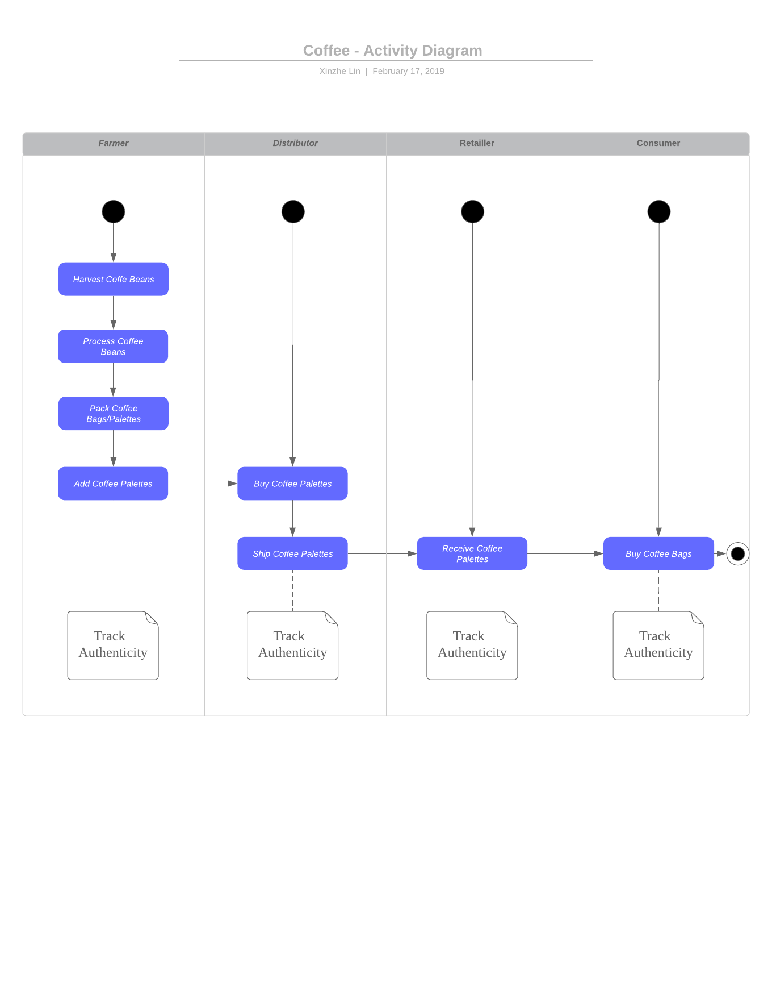

# Coffee Supply chain & data auditing

This repository containts an Ethereum DApp that demonstrates a Coffee Supply Chain flow between a Seller, Distributor, Retailer and Buyer. 

The user story is similar to any commonly used supply chain process. A Seller can add items to the inventory system stored in the blockchain. A Buyer can purchase such items from the inventory system. Additionally a Seller can mark an item as Shipped, and similarly a Buyer can mark an item as Received.

## The DApp UML: 




## Getting Started

These instructions will get you a copy of the project up and running on your local machine for development and testing purposes. See deployment for notes on how to deploy the project on a live system.

### Prerequisites

Please make sure you've already installed node, ganache-cli, Truffle and enabled MetaMask extension in your browser.

```
node v8.12.0 https://nodejs.org/en/download/
ganache-cli v6.3.0 (ganache-core: 2.4.0) https://www.truffleframework.com/docs/ganache/quickstart
Truffle v4.1.15 (core: 4.1.15) https://www.truffleframework.com/docs/truffle/getting-started/installation
MetaMask 6.0.1 https://metamask.io/
```

### Installing

A step by step series of examples that tell you have to get a development env running

Clone this repository:

```
git clone https://github.com/linxinzhe/nd1309-Project-6b-Coffee
```

Install all requisite npm packages (as listed in ```package.json```):

```
npm install
```

Launch Ganache:

```
ganache-cli -m "enlist scene predict panda element donkey essay mother original stand oven wheat"
```

In a separate terminal window, Compile smart contracts:

```
truffle compile
```

This will create the smart contract artifacts in folder ```build\contracts```.

Migrate smart contracts to the locally running blockchain, ganache-cli:

```
truffle migrate
```

Test smart contracts:

```
truffle test
```

In a separate terminal window, launch the DApp:

```
npm run dev
```

## Built With

* [Ethereum](https://www.ethereum.org/) - Ethereum is a decentralized platform that runs smart contracts
* [Truffle Framework](http://truffleframework.com/) - Truffle is the most popular development framework for Ethereum with a mission to make your life a whole lot easier.
* [lite-server](https://www.npmjs.com/package/lite-server) - Lightweight development only node server that serves a web app, opens it in the browser, refreshes when html or javascript change, injects CSS changes using sockets, and has a fallback page when a route is not found.
* [truffle-hdwallet-provider](https://github.com/trufflesuite/truffle-hdwallet-provider) - 
HD Wallet-enabled Web3 provider. Use it to sign transactions for addresses derived from a 12-word mnemonic.
## Acknowledgments

* Solidity
* Ganache-cli
* Truffle
* lite-server
* infura

## Deployment(Rinkeby)
```
Using network 'rinkeby'.

Running migration: 1_initial_migration.js
  Deploying Migrations...
  ... 0x192ce8e021ed4941239f86a037f3515f1335e7d4235d23208283cb5296a04a83
  Migrations: 0x13c3470acb122be6feefe7b6c8d6afa4e5eb6a2f
Saving successful migration to network...
  ... 0xbad962c3bcbc42c2e0ef3c6ac191827f5484b4ec6ea08666dbdbb7424b41db9a
Saving artifacts...
Running migration: 2_deploy_contracts.js
  Deploying FarmerRole...
  ... 0x1c3a4f6609d6e648be50e721da2253aa98eb76e628346b30e90b9588ebb1cdfe
  FarmerRole: 0xfd55d738355c33596138f42d67c3f3d6197d764c
  
  Deploying DistributorRole...
  ... 0xbe9f5e814f6e2133d9c2274b320148ca61c433c8c23f75da32ee9f0987bf24be
  DistributorRole: 0xc1810f9ed814b9007100aad95480cc6903c86c0f
  
  Deploying RetailerRole...
  ... 0x16799066a565bfbb1fc09e49e3efc6334632136db47d1dd87e1382f6e9e36a10
  RetailerRole: 0x5e8c369d33f02368abf89143bbbcf7bcea6942af
  
  Deploying ConsumerRole...
  ... 0x16d648dc3f0e5fca2bbeab44514ba1d790e67c482fd80268aa98ed748c7fbe62
  ConsumerRole: 0xede8e9b60d1fd33b286ba6a1777d9f2a0842e643
  
  Deploying SupplyChain...
  ... 0xa5ea8371ec0854b9103fab4ba78517ae603405e7f65685d41018eff2cb13c91c
  SupplyChain: 0xe26b0f8aafa48fba663de879ddc381a1705e3a38
  
Saving successful migration to network...
  ... 0x59f79790116faee9af32d51262b8668029e982dec052d6f99193e1300d5dfbc5
Saving artifacts...
```